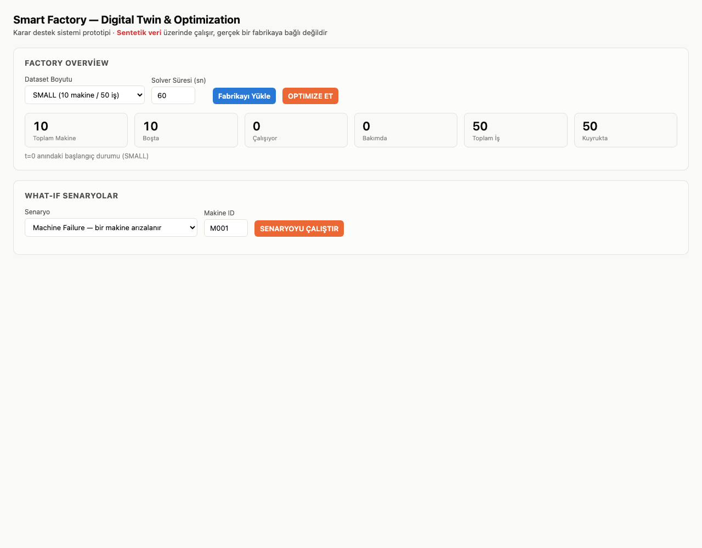
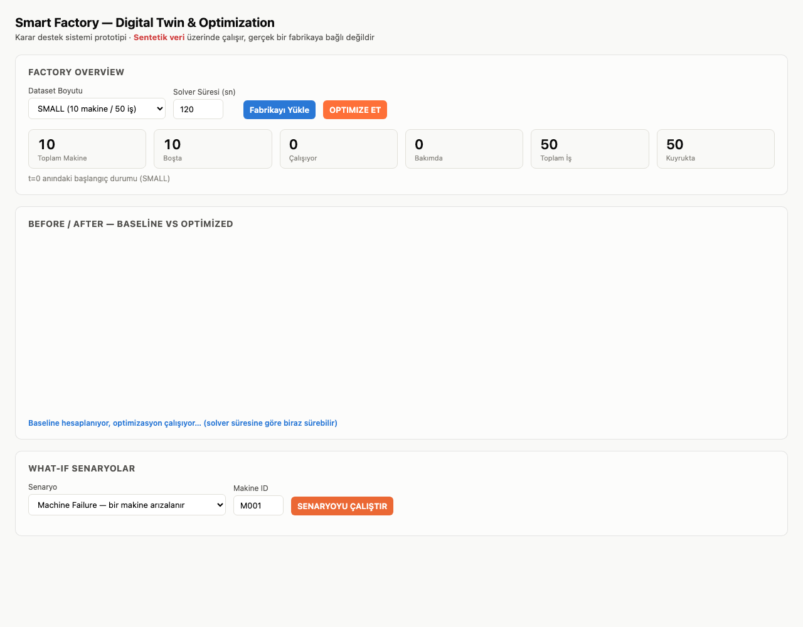
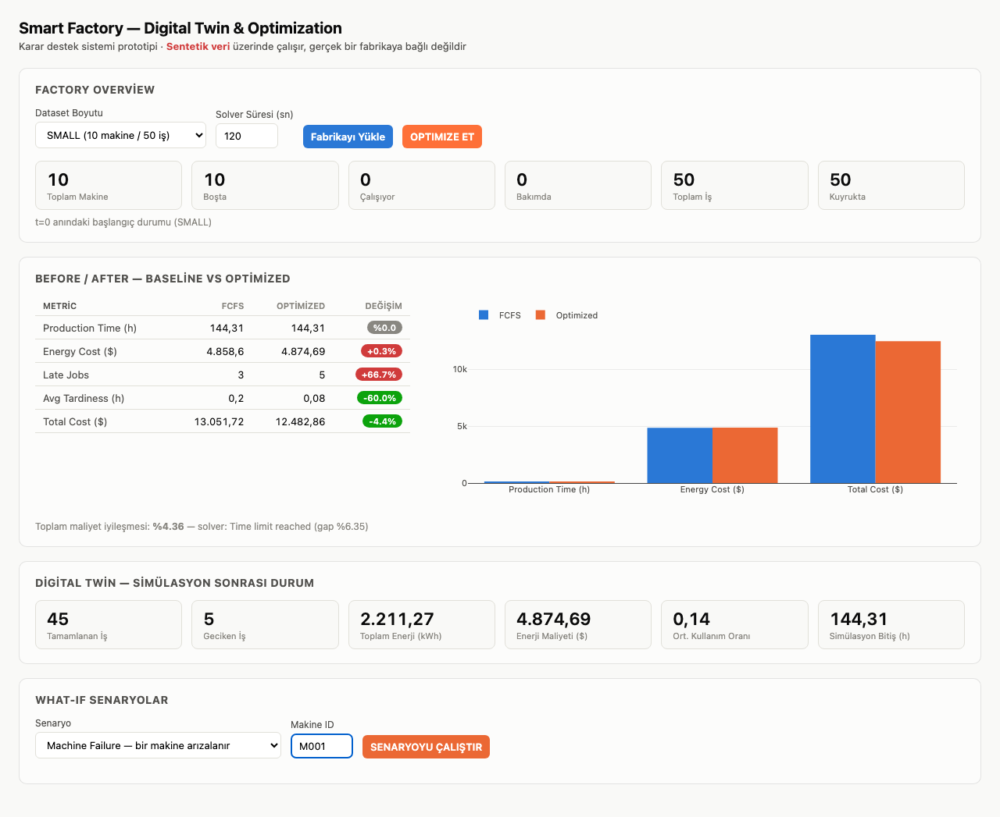
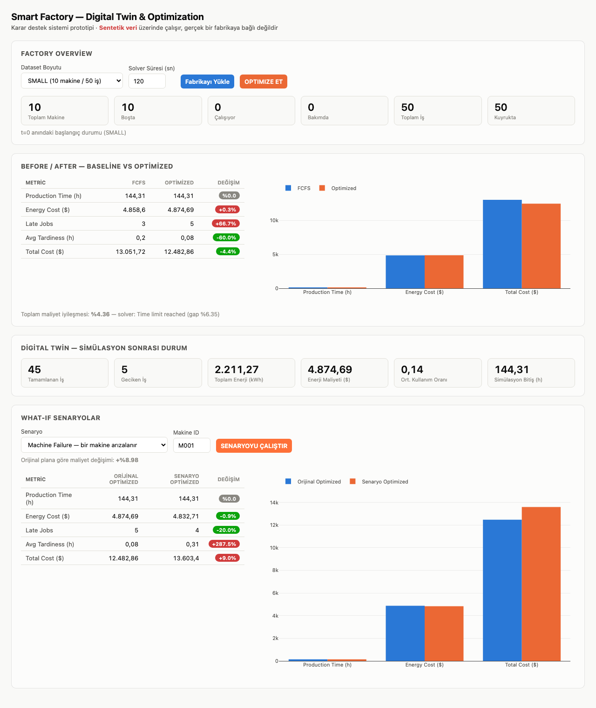

# Final Demo

> Projenin final ürünü — orijinal proje planındaki "Final Product" (Bölüm 14) akışının, gerçek çalışan sistemde, tarayıcıda uçtan uca kaydedilmiş hali. Aşağıdaki tüm sayılar ve ekran görüntüleri `docs/demo-screenshots/`'ta saklanan gerçek bir koşudan; hiçbiri uydurulmadı (bkz. `CLAUDE.md` kural 3).

**Not**: Tüm veriler `SEED=42` ile üretilmiş **sentetik** veridir, gerçek bir fabrikaya ait değildir (bkz. `docs/dataset.md`).

## Adım 1-5 — Dashboard Açılır, Fabrikanın Mevcut Durumu Görülür

Kullanıcı `http://127.0.0.1:8000/` adresini açar (`uvicorn backend.main:app --reload` ile başlatılır). Digital Twin'in t=0 anındaki durumu otomatik yüklenir: 10 makine (hepsi boşta), 50 iş (hepsi kuyrukta).



## Adım 6-9 — OPTIMIZE ET: ML Tahmini + Optimizasyon Çalışır

Kullanıcı "OPTIMIZE ET" butonuna basar. Arka planda (`backend/services/pipeline.py::run_pipeline`):
1. Phase 10'un ML modeli her operasyonun işlem süresini tahmin eder,
2. Phase 7-9'un MILP modeli bu tahminlerle, Phase 3'ün FCFS planından warm-start alarak optimize eder (`optimization/solver.py::solve_with_warm_start`),
3. Bulunan plan, GERÇEK sürelerle yeniden zamanlanır (Phase 11 — "tahmin hatasının bedeli" ölçümü burada devrede).



## Adım 10-11 — Digital Twin Simüle Eder, Before/After Gösterilir

Plan, Phase 14'ün simülasyon motorunda zaman içinde oynatılır; Digital Twin'in son durumu (tamamlanan/geciken iş, toplam enerji) ile Before/After paneli (Phase 18'in renkli rozetleri) aynı anda gösterilir.


**Bu koşuda ölçülen gerçek sonuç**: Toplam maliyette **%4.36 iyileşme** (solver: time limit, gap %6.35). Bu sayı, "mükemmel bilgiyle" elde edilebilecek %10.67'den (Phase 9) düşük — çünkü bu tam sistem, gerçek dünyadaki gibi ML **tahminiyle** çalışıyor, gerçek süreleri baştan bilmiyor (Phase 11'in bulgusu: tahmin hatasının gerçek bir bedeli var). Dashboard'da görülen sayı, projenin en "dürüst" sonucu — idealize edilmemiş, uçtan uca gerçek davranış.

## Adım 12 — Kullanıcı What-If Senaryo Seçer

Kullanıcı "Machine Failure" senaryosunu, yedeği olan bir makineyle (M001, 3 CNC'den biri) dener.



## Adım 13-15 — Digital Twin Yeni Durumu Simüle Eder, Sistem Yeniden Optimize Eder

"SENARYOYU ÇALIŞTIR" butonuna basılınca, `simulation/scenarios.py` dataset'i dönüştürür (M001 tüm ufuk boyunca kullanılamaz), Phase 16'nın pipeline'ı **aynı adımların hepsini** (ML tahmini → optimizasyon → simülasyon) bu yeni veriyle tekrar çalıştırır — ayrı bir kod yolu değil, "re-optimization".



**Bu koşuda ölçülen gerçek sonuç**: M001 arızasıyla toplam maliyet **+%8.98** arttı (geçerli, uygulanabilir yeni bir plan bulundu — yedekli makine arızası sistemi durdurmuyor, sadece maliyetlendiriyor; Phase 15'in M003/M001 bulgusuyla tutarlı).

## Değerlendirme

Bu demo, projenin `docs/project-plan.md`'de tanımlanan döngüsünü (`Factory Data → Digital Twin → ML → Optimization → Simulation → Scenario → Re-Optimization`) uçtan uca, gerçek kodla, konsol hatası olmadan çalıştırıyor. Sistemin bilinen sınırları (`docs/architecture.md` Bölüm 4 — ölçeklenme, solver reproducibility) bu demoda SMALL ölçekte devreye girmiyor; MEDIUM/LARGE'da davranış `docs/experiments.md`'de ayrıca belgelendi.

## Nasıl Tekrar Çalıştırılır

```bash
uvicorn backend.main:app --reload
# tarayıcıda http://127.0.0.1:8000/
```

Ya da doğrulama scripti olarak (Playwright, headless):

```bash
python3 -c "import playwright" && echo "playwright kurulu"
# bkz. docs/decision-log.md Phase 17/Final Demo — tarayıcı testi driver script'i
```
